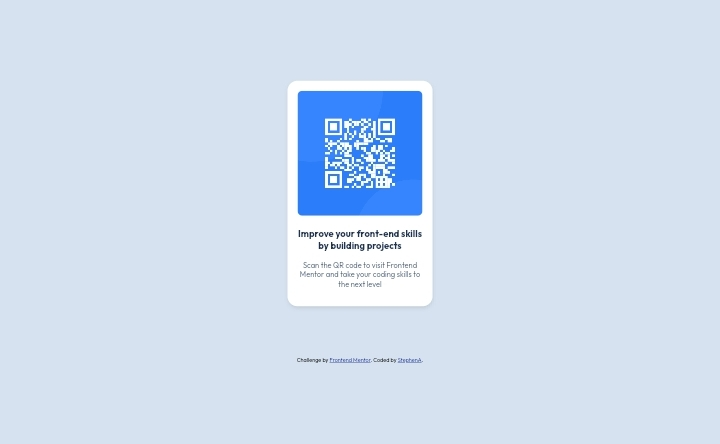

# Frontend Mentor - QR code component solution

This is a solution to the [QR code component challenge on Frontend Mentor](https://www.frontendmentor.io/challenges/qr-code-component-iux_sIO_H). Frontend Mentor challenges help you improve your coding skills by building realistic projects.

## Table of contents

- [Overview](#overview)
  - [Screenshot](#screenshot)
  - [Links](#links)
- [My process](#my-process)
  - [Built with](#built-with)
  - [What I learned](#what-i-learned)
  - [Continued development](#continued-development)
  - [Useful resources](#useful-resources)
- [Author](#author)
- [Acknowledgments](#acknowledgments)

## Overview

### Screenshot



### Links

- Solution URL: [https://github.com/Codestephenn/Qr-code-component.git](https://github.com/Codestephenn/Qr-code-component.git)
- Live Site URL: [https://codestephenn.github.io/Qr-code-component/](https://codestephenn.github.io/Qr-code-component/)

## My process

### Built with

- Semantic HTML5 markup
- CSS custom properties
- Flexbox
- Mobile-first workflow

### What I learned

Working on this project helped reinforce the importance of responsive design and how to use Flexbox for centering content. Here's an example of the CSS I used to center the card:

```css
body {
  display: flex;
  flex-direction: column;
  justify-content: center;
  align-items: center;
  min-height: 100vh;
  margin: 0;
  background-color: hsl(212, 45%, 89%);
}
```

### Continued development

In future projects, I plan to continue improving my responsive design skills and explore more advanced CSS layout techniques, such as CSS Grid. I also want to get more comfortable with accessibility best practices to ensure my projects are usable by everyone.

### Useful resources

- [MDN Web Docs - Flexbox](https://developer.mozilla.org/en-US/docs/Learn/CSS/CSS_layout/Flexbox) - This resource helped me understand how to use Flexbox to center elements on the page.
- [Google Fonts](https://fonts.google.com/) - I used Google Fonts to easily integrate the "Outfit" font into my project.

## Author

- Frontend Mentor - [Codestephenn](https://www.frontendmentor.io/profile/Codestephenn)
- X - [@stephenn_at](https://www.x.com/stephenn_at)

## Acknowledgments

I'd like to thank the Frontend Mentor community for providing helpful feedback and inspiration. The resources and challenges have been invaluable in improving my front-end skills.
